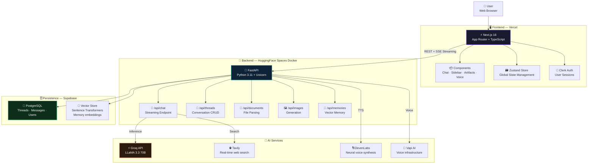
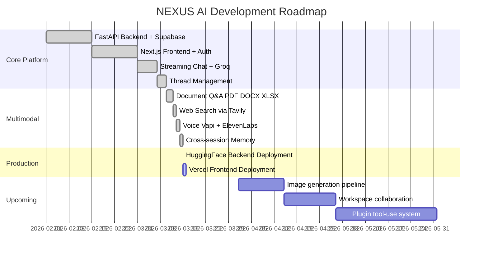

<div align="center">

[]()
[]()
[]()
[]()
[]()
[]()
<br/>
[]()
[]()
[]()

</div>

<h1 align="center">🤖 NEXUS AI</h1>

<h3 align="center"><em>A Claude.ai-inspired full-stack multimodal AI assistant platform</em></h3>

<p align="center">
  Real-time streaming chat · Web search · Document Q&A · Voice interaction · Image generation · Persistent memory
</p>

<p align="center">
  <a href="#-overview">🌟 Overview</a> ·
  <a href="#-architecture">🏗️ Architecture</a> ·
  <a href="#-features">✨ Features</a> ·
  <a href="#-tech-stack">🚀 Tech Stack</a> ·
  <a href="#-quickstart">⚡ Quickstart</a> ·
  <a href="#-deployment">🌍 Deployment</a>
</p>

<div align="center">
  <blockquote>
    <em>"Stream. Search. Speak. Remember. One platform, infinite intelligence."</em>
  </blockquote>
</div>

<hr/>

## 🌟 Overview

**NEXUS AI** is a production-grade, full-stack multimodal AI assistant — built from scratch, inspired by Claude.ai. It combines a **Next.js 16** frontend with a **FastAPI** backend powered by **Groq's LLaMA 3.3 70B** for blazing-fast inference, with real-time web search, document analysis, voice interaction, and persistent conversation memory.

Unlike toy demos, NEXUS AI is architected for **real production deployment** — Docker on HuggingFace Spaces for the backend, Vercel for the frontend, with Supabase handling all persistence.

```text
User Input: "Summarize this PDF and find recent news about it"
      |
      ▼
┌─────────────────────────────────────────────────────────────────┐
│                      NEXUS AI PLATFORM                          │
│                                                                  │
│  [Document Parser] ──► [Tavily Search] ──► [Groq LLaMA 3.3]   │
│         Context Assembly · Streaming Response · Memory Save     │
└──────────────────────────┬──────────────────────────────────────┘
                           ▼
     Streamed response · Artifact rendered · Thread saved to DB
```

> Built by [@kumardhruv88](https://github.com/kumardhruv88) — **National Winner, Smart India Hackathon 2025** | GSoC 2026 Candidate

<hr/>

## ✨ Features

| Feature | Description | Technologies |
| :--- | :--- | :--- |
| 💬 **Streaming Chat** | Real-time token-by-token response streaming | Groq, SSE, FastAPI |
| 🌐 **Web Search** | Live internet search injected into LLM context | Tavily API |
| 📄 **Document Q&A** | Upload PDFs, DOCX, XLSX — ask anything | PyPDF2, python-docx, openpyxl |
| 🖼️ **Image Generation** | Text-to-image AI generation pipeline | Custom pipeline |
| 🎙️ **Voice Interaction** | Speak to the AI, hear it respond naturally | Vapi AI + ElevenLabs |
| 🧵 **Thread Management** | Full persistent conversation history | Supabase PostgreSQL |
| 🧠 **Cross-session Memory** | AI remembers across conversations | Sentence Transformers + Vector Store |
| 📦 **Artifacts** | Inline code, markdown, and HTML rendering | Custom renderer |
| 🔐 **Auth** | Secure user authentication & sessions | Clerk |
| 🌑 **Dark UI** | Sleek Claude.ai-inspired dark interface | Tailwind CSS + Framer Motion |

<hr/>

## 🏗️ Architecture

NEXUS AI is a **full-stack monorepo** with a clean separation between the Next.js frontend and FastAPI backend, communicating over a typed REST API.



<hr/>

## 🔌 Component Details

<details>
<summary>💬 <b>Streaming Chat Engine</b> — Real-time LLaMA 3.3 70B via Groq</summary>
<br>

The core chat pipeline assembles context from multiple sources before sending to Groq:

```python
# Context assembly pipeline
context = []
if uploaded_doc:    context += parse_document(file)       # Document chunks
if web_search_on:   context += tavily.search(query)       # Live web results
if memory_enabled:  context += vector_store.recall(query) # Past memories

# Stream response token by token
async for chunk in groq.chat.completions.stream(
    model="llama-3.3-70b-versatile",
    messages=context + [{"role": "user", "content": query}]
):
    yield chunk.choices[0].delta.content
```

Every response is saved to Supabase and optionally embedded into the vector memory store.
</details>

<details>
<summary>🧠 <b>Memory Service</b> — Cross-session Vector Memory</summary>
<br>

NEXUS AI remembers across conversations using sentence embeddings:

| Component | Technology | Purpose |
| :--- | :--- | :--- |
| `SentenceTransformer` | `all-MiniLM-L6-v2` | Embed messages into 384-dim vectors |
| `VectorStore` | NumPy + cosine similarity | Fast in-memory semantic search |
| `MemoryService` | Supabase + vector store | Persist and retrieve relevant memories |

When a new message arrives, the top-k most semantically similar past memories are retrieved and injected into the prompt context.
</details>

<details>
<summary>📄 <b>Document Service</b> — Multi-format File Parsing</summary>
<br>

Upload and query any document type:

| Format | Library | Extraction |
| :--- | :--- | :--- |
| **PDF** | PyPDF2 | Full text extraction, page-by-page |
| **DOCX** | python-docx | Paragraphs, tables, headings |
| **XLSX** | openpyxl | Sheet data, cell values |
| **TXT** | built-in | Raw text |

Extracted text is chunked and injected into the LLM context with source attribution.
</details>

<details>
<summary>🎙️ <b>Voice Layer</b> — Speak and Listen with ElevenLabs + Vapi</summary>
<br>

Full duplex voice interaction:
- **Input**: Vapi AI handles microphone capture and transcription
- **Output**: ElevenLabs neural TTS converts AI responses to natural speech
- **Streaming**: Audio is streamed back in real-time, not buffered
- **Models**: Multiple voice personas selectable per session
</details>

<details>
<summary>🌐 <b>REST API Reference</b></summary>
<br>

```bash
uvicorn api.index:app --reload --port 8000
# Swagger UI: http://localhost:8000/docs
```

| Endpoint | Method | Description |
| :--- | :--- | :--- |
| `/` | GET | Health check — `{"status": "NEXUS AI Backend Running"}` |
| `/api/chat` | POST | Streaming chat with optional search + memory |
| `/api/threads` | GET/POST | List or create conversation threads |
| `/api/threads/{id}` | GET/DELETE | Get or delete a thread |
| `/api/threads/{id}/messages` | GET | Fetch all messages in a thread |
| `/api/documents/upload` | POST | Upload and parse a document |
| `/api/images/generate` | POST | Generate an image from text |
| `/api/memories` | GET/POST | Retrieve or save memories |

</details>

<hr/>

## 📁 Project Structure

```text
nexus-ai/
│
├── 📂 frontend/                         # Next.js 16 + TypeScript
│   ├── 📂 app/                          # App Router
│   │   ├── (auth)/                      # Clerk auth pages
│   │   ├── chat/[threadId]/             # Dynamic chat route
│   │   └── layout.tsx                   # Root layout + providers
│   │
│   ├── 📂 components/                   # Reusable UI components
│   │   ├── chat/                        # ChatInput, MessageList, StreamingMessage
│   │   ├── sidebar/                     # ThreadSidebar, ThreadItem
│   │   ├── artifacts/                   # CodeBlock, MarkdownRenderer, HTMLArtifact
│   │   └── voice/                       # VoiceButton, AudioPlayer
│   │
│   ├── 📂 lib/                          # Utilities & hooks
│   │   ├── store.ts                     # Zustand global state
│   │   ├── api.ts                       # Backend API client
│   │   └── hooks/                       # useChat, useVoice, useMemory
│   │
│   ├── .env.local                       # Frontend environment variables
│   └── package.json
│
├── 📂 backend/                          # FastAPI + Python 3.11
│   ├── 📂 api/                          # Route handlers
│   │   ├── index.py                     # FastAPI app entry point
│   │   ├── chat.py                      # Streaming chat + context assembly
│   │   ├── threads.py                   # Thread CRUD operations
│   │   ├── documents.py                 # File upload & parsing
│   │   ├── images.py                    # Image generation pipeline
│   │   ├── memories.py                  # Memory read/write
│   │   ├── artifacts.py                 # Artifact management
│   │   └── workspaces.py               # Workspace operations
│   │
│   ├── 📂 services/                     # Business logic layer
│   │   ├── db_service.py               # Supabase PostgreSQL operations
│   │   ├── search_service.py           # Tavily web search
│   │   ├── document_service.py         # Multi-format file parsing
│   │   ├── memory_service.py           # Cross-session memory logic
│   │   └── vector_store.py             # Sentence embeddings + cosine search
│   │
│   ├── Dockerfile                       # HuggingFace Spaces Docker config
│   ├── requirements.txt                 # Python dependencies
│   └── .env                            # Backend secrets (gitignored)
│
├── .env.example                         # Environment variable template
├── .gitignore
└── README.md
```

<hr/>

## 🚀 Tech Stack

### Frontend
| Technology | Version | Purpose |
| :--- | :--- | :--- |
| **Next.js** | 16 | React framework, App Router, SSR |
| **TypeScript** | 5.x | Type-safe development |
| **Tailwind CSS** | 4.x | Utility-first dark UI styling |
| **Framer Motion** | Latest | Smooth animations & transitions |
| **Zustand** | Latest | Lightweight global state management |
| **Clerk** | Latest | Authentication & user sessions |

### Backend
| Technology | Version | Purpose |
| :--- | :--- | :--- |
| **FastAPI** | 0.111.0 | High-performance async Python API |
| **Uvicorn** | 0.29.0 | ASGI production server |
| **Supabase** | 2.7.4 | PostgreSQL + Auth + Storage |
| **Sentence Transformers** | 2.7.0 | Text embeddings for memory |
| **PyPDF2** | 3.0.1 | PDF text extraction |
| **python-docx** | 1.1.0 | DOCX parsing |
| **openpyxl** | 3.1.2 | Excel file parsing |

### AI & External APIs
| Service | Purpose | Speed |
| :--- | :--- | :--- |
| **Groq (LLaMA 3.3 70B)** | Primary LLM inference | ~200ms TTFT |
| **Tavily** | Real-time web search | ~500ms |
| **ElevenLabs** | Neural text-to-speech | ~300ms |
| **Vapi AI** | Voice infrastructure | Real-time |

<hr/>

## ⚡ Quickstart

### Prerequisites
- Node.js v18+
- Python 3.11+
- Supabase project
- API keys: Groq, Tavily, ElevenLabs, Vapi, Clerk

### 1. Clone the repository
```bash
git clone https://github.com/kumardhruv88/multimodel.git
cd multimodel
```

### 2. Frontend Setup
```bash
cd frontend
npm install
cp .env.example .env.local
# Fill in your keys in .env.local
npm run dev
# Runs at http://localhost:3000
```

### 3. Backend Setup
```bash
cd backend
python -m venv .venv
.venv\Scripts\activate        # Windows
# source .venv/bin/activate   # macOS/Linux

pip install -r requirements.txt
# Create .env with your keys
uvicorn api.index:app --reload --port 8000
# API docs at http://localhost:8000/docs
```

<hr/>

## 🌍 Deployment

### Backend → HuggingFace Spaces (Docker)

```bash
cd backend
git init
git remote add origin https://huggingface.co/spaces/YOUR_HF_USERNAME/nexus-ai-backend
git add .
git commit -m "Deploy backend"
git branch -M main
git push origin main --force
```

Add these in HF Space → **Settings → Variables and secrets**:

| Secret | Source |
| :--- | :--- |
| `GROQ_API_KEY` | [console.groq.com](https://console.groq.com) |
| `TAVILY_API_KEY` | [app.tavily.com](https://app.tavily.com) |
| `ELEVEN_API_KEY` | [elevenlabs.io](https://elevenlabs.io) |
| `SUPABASE_URL` | Supabase → Settings → General |
| `SUPABASE_SERVICE_ROLE_KEY` | Supabase → Settings → API |

Backend live at: `https://YOUR_HF_USERNAME-nexus-ai-backend.hf.space`

### Frontend → Vercel

1. [vercel.com](https://vercel.com) → **New Project** → Import `multimodel`
2. Set **Root Directory** to `frontend`
3. Add all env vars from `.env.local`
4. Click **Deploy** 🚀

<hr/>

## 🔑 Environment Variables

```env
# ── Frontend (.env.local) ──────────────────────────────────────
NEXT_PUBLIC_CLERK_PUBLISHABLE_KEY=pk_test_...
CLERK_SECRET_KEY=sk_test_...
NEXT_PUBLIC_VAPI_PUBLIC_KEY=...
NEXT_PUBLIC_SUPABASE_URL=https://xxxx.supabase.co
NEXT_PUBLIC_SUPABASE_ANON_KEY=eyJ...
NEXT_PUBLIC_API_URL=https://your-hf-username-nexus-ai-backend.hf.space

# ── Backend (.env) ─────────────────────────────────────────────
GROQ_API_KEY=gsk_...
TAVILY_API_KEY=tvly-...
ELEVEN_API_KEY=sk_...
SUPABASE_URL=https://xxxx.supabase.co
SUPABASE_SERVICE_ROLE_KEY=eyJ...
```

<hr/>

## 🗺️ Roadmap



### Feature Status

- [x] **Streaming chat** — Groq LLaMA 3.3 70B
- [x] **Web search** — Tavily real-time search
- [x] **Document Q&A** — PDF, DOCX, XLSX
- [x] **Voice interaction** — Vapi + ElevenLabs
- [x] **Cross-session memory** — vector store
- [x] **Thread management** — full CRUD
- [x] **Artifact rendering** — code, markdown, HTML
- [x] **Production deployment** — HF Spaces + Vercel
- [ ] **Image generation** — text-to-image pipeline
- [ ] **Workspace collaboration** — multi-user threads
- [ ] **Plugin system** — custom tool integrations
- [ ] **Mobile app** — React Native

<hr/>

## 🤝 Contributing

```bash
git clone https://github.com/kumardhruv88/multimodel.git
cd multimodel
git checkout -b feature/your-feature
git commit -m "feat: your feature description"
git push origin feature/your-feature
# Open a Pull Request on GitHub
```

<hr/>

## 📜 License

Distributed under the **MIT License**. See [LICENSE](LICENSE) for details.

<div align="center">

Built with ❤️ by **[Dhruv Kumar](https://github.com/kumardhruv88)**

National Winner · Smart India Hackathon 2025 | GSoC 2026 Candidate

<br/>

[](https://github.com/kumardhruv88/multimodel)
[](https://github.com/kumardhruv88/multimodel/fork)

⭐ **Star this repo if you found it useful!**

</div>
